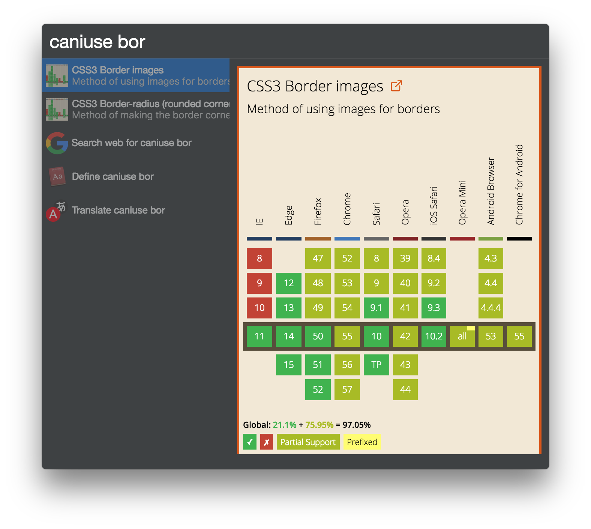

# cerebro-caniuse

> [Cerebro](http://www.cerebroapp.com) plugin for quick access to [caniuse.com](http://caniuse.com/) database

## Usage

In Cerebro, type `caniuse ` and search for interested front-end web technology.

## Related

- [Cerebro](http://github.com/KELiON/cerebro) – main repo for Cerebro app;
- [cerebro-plugin](https://github.com/KELiON/cerebro-plugin) – boilerplate to create plugins for Cerebro app;
- [caniuse-embed](https://github.com/ireade/caniuse-embed) – script for embedding canise, used in this plugin.

## License

MIT © [Alexandr Subbotin](http://asubbotin.ru)
